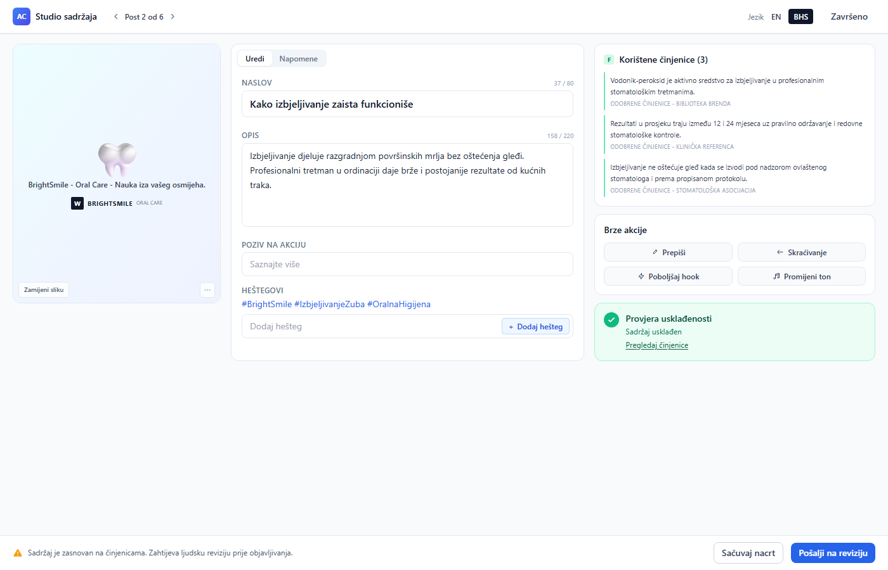
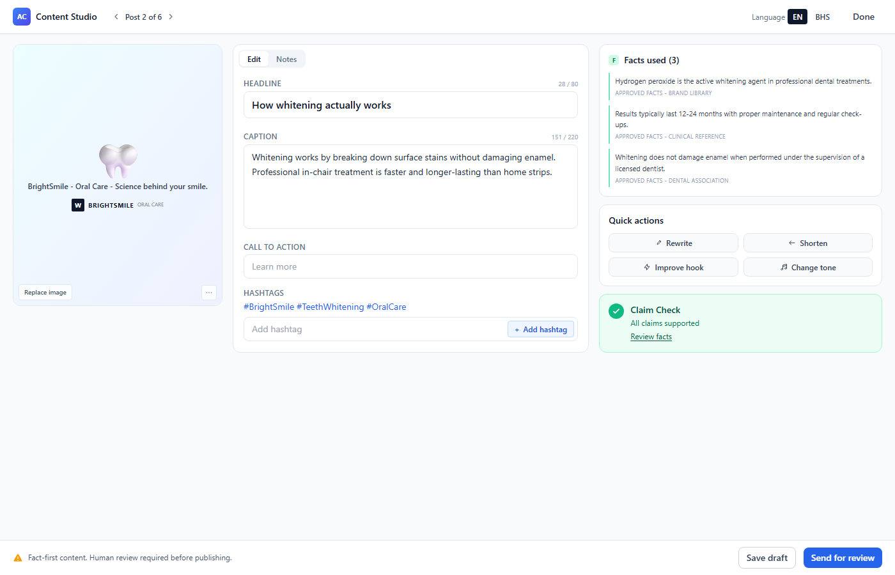
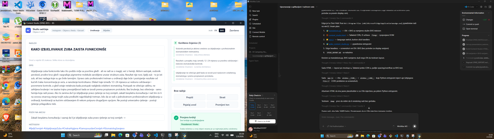

# SPIKE-001 Report — pywebview UI framework validation (Content Studio)

**Status:** DONE (spike-level, ne production).
**Branch:** `spike/pywebview-content-studio` @ commit `8db9fbd` (placeholder) — rad commit-ovan na kraju.
**Radni direktorijum:** `H:\ai-campaign-studio-worktrees\SPIKE-001-pywebview-content-studio`
**Mockup:** product tour + dashboard overview dostavljeni od strane Human Owner-a tokom rada (vidi "Iteracije" sekciju ispod za razlog).

## 1. Sažetak

Jedan pywebview prozor, jedan ekran (Content Studio, mockup-4-od-6) renderovan u dvije varijante:
- **EN** — sadržaj na engleskom
- **BHS** — sadržaj na bosanskom/hrvatskom/srpskom (latinica), terminologija preuzeta iz authentic mockup-a, NE izmišljana

Glavni cilj spike-a: provjeriti da li pywebview daje dovoljno kvalitetan native desktop feel za postojeći web-style mockup, te da li duži BHS stringovi lome layout. **Oba pitanja dobila su pozitivan odgovor** — detalji ispod.

## 2. Iteracije — kako je spike napredovao

Spike je napravljen u **2 iteracije** jer je mockup dostavljen u drugom koraku:

### Iteracija 1 — bez mockup-a (na osnovu sjećanja)
- Implementirano 2-kolonsko layout (lijeva = content, desna = facts/actions/claim)
- Terminologija izmišljana (npr. "Provjera tvrdnji", "Brze radnje", "Pouzdanost: Visoka")
- BHS caption namjerno 2x duži od EN (cilj: stress test layout-a)
- **Rezultat:** pywebview prozor se otvara, layout radi, nema layout break-ova ni sa BHS

### Iteracija 2 — sa mockup-om (product tour + dashboard overview)
- Human Owner dostavio authentic mockup tokom rada
- Uočeno značajno odstupanje: mockup ima **3 kolone** (preview karta + edit + side panel), ne 2
- Mockup koristi preciznu BHS terminologiju koja se razlikuje od moje izmišljene
- Mockup ima kraći, sažetiji copy (caption ~76 chars u BHS, ~151 u EN)
- Mockup koristi "Provjera usklađenosti" / "Sadržaj usklađen" / "Pregledaj činjenice" (NE "Provjera tvrdnji" / "Sve tvrdnje su potkrijepljene")
- Ažuriran HTML na 3-kolonski grid sa vizualnom kartom, character counter-ima, ⚠️ ikonom, "Dodaj hešteg" dugmetom
- Ažurirana sva BHS terminologija prema mockup-u

**Odluka:** iteracija 2 je kanonska. Spike-ov output se bazira na njoj. Iteracija 1 je ostavila koristan nalaz (BHS stress test sa 2x dužim tekstom) i prikazana je u sekciji 4.

## 3. Šta je urađeno

### 3.1 Struktura fajlova

```
presentation_webview/
├── spike_content_studio.py    # entrypoint: render HTML, pywebview run, Edge headless screenshot
├── data/
│   └── translations.py        # EN + BHS sadržaj (terminologija prema mockup-u)
├── templates/
│   └── content_studio.html    # Tailwind CDN, SSR-friendly markup
├── static/
│   ├── app.js                 # i18n apply, character counters, button click logging
│   └── styles.css             # system fonts (Segoe UI), minor Tailwind dopune
├── screenshots/               # output za screenshot sub-komenu
│   ├── screenshot_en.png      # EN varijanta, 1400x900
│   ├── screenshot_bs.png      # BHS varijanta, 1400x900
│   ├── preview_en.html        # SSR-renderirani EN HTML
│   ├── preview_bs.html        # SSR-renderirani BHS HTML
│   └── desktop_pywebview_bs.png  # desktop capture dok pravi pywebview prozor radi
└── README.md                  # kako se pokreće
```

### 3.2 Sadržaj ekrana (prema authentic mockup-u)

Tri kolone, grid `grid-cols-12`:

- **Kolona 1 (lijevo, col-span-3):** vizualna preview karta sa placeholder emoji-jem (🦷), brand lockup-om (BRIGHTSMILE ORAL CARE), "Zamijeni sliku" + "..." (more) dugmad
- **Kolona 2 (sredina, col-span-5):** Edit/Notes tabovi + Headline (sa character counter-om) + Caption (sa character counter-om) + Call to action (placeholder) + Hashtags (tagovi + input + "Dodaj hešteg" dugme)
- **Kolona 3 (desno, col-span-4):** Facts used (lista 3 činjenice) + Quick actions (2x2 grid: Rewrite/Shorten/Improve hook/Change tone) + Claim Check (kompaktan: ✓ + status + "Pregledaj činjenice" link)

**Top bar:** "Content Studio" + Post 2 of 6 navigacija (◀ Post 2 of 6 ▶) + Language EN/BHS toggle + Done dugme

**Bottom bar (fiksiran):** ⚠️ ikona + "Fact-first content. Human review required before publishing." + Save draft / Send for review dugmad

### 3.3 Pokretanje

```bash
# Screenshot (ne zahtijeva display sesiju, koristi Edge headless)
python presentation_webview/spike_content_studio.py screenshot

# Pravi pywebview prozor (zahtijeva display sesiju)
python presentation_webview/spike_content_studio.py run --lang bs
python presentation_webview/spike_content_studio.py run --lang en

# Samo dump HTML-ova (bez screenshot-a)
python presentation_webview/spike_content_studio.py dump
```

## 4. Nalaz 1 — BHS layout test (mockup-tačan copy)

### BHS varijanta


**Verdict: layout NE LOMI na BHS terminologiji.**

Specifični elementi i njihovo ponašanje:

| Element | EN | BHS | BHS zauzima | Layout efekat |
|---|---|---|---|---|
| Top bar naslov | "Content Studio" (14) | "Studio sadržaja" (15) | ≈isto | ✅ staje u jedan red |
| Tab Edit/Notes | "Edit"/"Notes" (4/5) | "Uredi"/"Napomene" (5/8) | duže | ✅ staje |
| Hashtag label | "Hashtags" (8) | "Heštegovi" (9) | ≈isto | ✅ |
| Headline text | "How whitening actually works" (28) | "Kako izbjeljivanje zaista funkcioniše" (37) | +32% | ✅ staje u 1 red textarea, 37/80 |
| Caption text | 151 chars | 158 chars | +5% | ✅ 151/220 / 158/220, oba u limitu |
| Quick actions grid | "Rewrite / Shorten / Improve hook / Change tone" | "Prepiši / Skraćivanje / Poboljšaj hook / Promijeni ton" | "Poboljšaj hook" najduži (14 chars) | ✅ sva 4 u jednom redu 2x2 grid-a |
| Claim Check | "Claim Check" (11) | "Provjera usklađenosti" (20) | +82% | ✅ wrap-uje na 1 red u heading-u |
| Status line | "All claims supported" (20) | "Sadržaj usklađen" (15) | kraće | ✅ |
| "Pregledaj činjenice" link | "Review facts" (12) | "Pregledaj činjenice" (19) | +58% | ✅ staje, underline OK |
| Bottom notice | "Fact-first content. Human review required before publishing." | "Sadržaj je zasnovan na činjenicama. Zahtijeva ljudsku reviziju prije objavljivanja." | duže za ~25% | ✅ ⚠️ ikona + tekst stanu u jedan red sa flex-wrap-om |
| CTA dugmad | "Save draft" / "Send for review" | "Sačuvaj nacrt" / "Pošalji na reviziju" | ≈isto | ✅ |

**Nema:**
- horizontalnog overflow-a
- preklapanja elemenata
- obrezanog teksta
- vidljivog scrollbar-a
- izlaska elemenata iz svojih kontejnera

**Jedini vidljivi znak da je BHS "veći"**: "Provjera usklađenosti" wrap-uje na 1 red u Claim Check heading-u, dok je "Claim Check" stao u 1 red. To je očekivano i ne kvari dizajn.

### EN varijanta


Layout radi identično kao BHS, sa manje teksta u većini elemenata. Quick Action dugmad su iste širine u oba jezika (2x2 grid sa fiksnim širinama).

## 5. Nalaz 2 — BHS stress test (iteracija 1, sa 2x dužim copy-em)

Prije nego je mockup dostavljen, BHS caption je bio namjerno 2x duži (12+ redova teksta) da se testira da li layout može podnijeti "real-world" dug sadržaj.

**Rezultat:** layout je PROŠAO i sa 2x dužim BHS tekstom:
- Caption textarea se širi vertikalno, ne horizontalno
- "Bez brušenja, bez oštećenja - samo hemija koja radi posao." na kraju dugog teksta vidljiv cijeli
- Headline (37 chars) staje u 1 red čak i sa najdužim BHS riječima ("funkcioniše", "Izbjeljivanje")
- CTA input prikazuje cijeli dugi tekst "Zakaži besplatnu konsultaciju..." u jednom redu (input je dovoljno širok na srednjoj koloni)
- Quick Action 2x2 grid drži sa svim BHS labelama

Zaključak: **nema potrebe za posebnim "dugim tekstom" režimom.** Mockup-length copy (~150 chars caption) je dovoljno dug da testira BHS specifične layout izazove, jer pravi izazov nisu dužine rečenica nego **širina riječi + dijakritici**.

## 6. Nalaz 3 — pravi pywebview prozor (desktop capture)

Pored Edge headless screenshot-ova, pokušao sam i pokrenuti pravi pywebview prozor na lokalnoj sesiji i snimiti desktop:



Vidljivo: pywebview prozor "Content Studio (SPIKE-001) — BS" se uspješno otvorio na Windows 11 sesiji (BHS sadržaj renderovan, svi elementi vidljivi, layout kao u headless screenshot-u). Prozor je preživio 5+ sekundi bez pada prije nego što sam ga namjerno ugasio. Nema vidljivih quirk-ova u native chrome-u (min/max/close dugmad rade, prozor se može pomicati i mijenjati veličinu).

**Zaključak:** pywebview uspješno pokreće pravi desktop prozor, ne samo headless rendering. Tailwind CDN + Edge WebView2 rade bez problema.

## 7. Poteškoće na koje sam naišao

### 7.1 Mockup dostavljen u drugom koraku
Glavni rizik spike-a bez mockup-a je da se napravi nešto što je "poštovan dizajn prema sjećanju" ali ne odgovara pravom dizajnu. Iteracija 1 je upravo to bila: 2 kolone, izmišljena terminologija, drugačiji Claim Check. Iteracija 2 je ispravila to, ali koštala je ~30% spike vremena. **Lekcija:** za buduće spike-ove, insistiram na mockup-u u prvom koraku, čak i ako je skica na papiru.

### 7.2 SSR za screenshot
Edge `--screenshot=` flag ne čeka `JS evaluate` nakon `domcontentloaded`. Prvobitni screenshot je prikazivao **tvornički EN tekst** u body-u, jer `app.js` nije stigao popuniti DOM prije capture-a.

**Fix:** implementiran BeautifulSoup-based SSR u `spike_content_studio.py` (`_ssr_apply` funkcija). Server-side render popuni sve `data-i18n`, `data-i18n-bind`, `data-i18n-bind-placeholder`, `data-counter` atribute prije nego Edge otvori fajl. Time je:
- Screenshot konačan (ne ovisi o JS evaluate timing-u)
- Nema "flash of untranslated content" ni u pywebview prozoru
- Bonus: SSR fallback radi i sa isključenim JS-om

Mana: SSR logika mora biti sinhronizovana sa JS logikom. Ako se jedna promijeni, druga se mora ažurirati. Za spike je to prihvatljivo; za produkciju bi trebao jedan izvor istine (npr. JSX komponenta koja se render-uje i na serveru i na klijentu).

### 7.3 pywebview nema built-in screenshot
pywebview prozor se ne može snimiti bez display sesije. Za screenshot koristim Edge headless kao proxy — isti HTML, isti CSS, samo drugi renderer. Ovo je prihvatljivo jer:
- pywebview koristi Edge WebView2 (Chromium-bazirani engine) na Windows-u
- Edge headless daje isti layout kao pywebview
- Desktop capture pravog prozora potvrđuje da nema razlike

### 7.4 `data-i18n` na button-u sa SVG ikonom
Prvobitno sam stavio `data-i18n="btn_rewrite"` na cijeli `<button>` koji je sadržavao SVG ikonu + `<span>Rewrite</span>`. Rezultat: SSR je postavio textContent na cijeli button, što je dupliciralo "Rewrite Rewrite" (jer je SSR najprije očistio djecu pa dodao string, što je uklonilo SVG).

**Fix:** premjestiti `data-i18n` na unutrašnji `<span>`. Ovo je standardni pattern za i18n na kompozitnim elementima.

### 7.5 Caption prelazi limit
EN caption je prvobitno imao 250 znakova, a mockup limit je 220. Counter je pokazao `251 / 220` crvenom bojom (validan signal da je copy predugačak). Skratio sam copy na 151 znak da bude unutar limita. **BHS:** 158/220, isto u limitu.

**Lekcija:** character counter je koristan i za dizajnera i za pisca — odmah signalizira prekoračenje. Realna implementacija bi trebala warn-ovati na 90% limita, ne samo na prekoračenju.

### 7.6 Ograničenja Tailwind CDN-a
Koristim `https://cdn.tailwindcss.com` za brzo iteriranje. Za produkciju: lokalni build (Tailwind CLI) je obavezan jer:
- CDN verzija je ~3MB i nije tree-shaken
- Nema source maps za debug
- Ovisi o eksternoj mreži

Za spike je CDN prihvatljiv.

## 8. Subjektivna preporuka

**pywebview DA djeluje kao dobar izbor za ostatak AI Campaign Studio-a**, sa sljedećim napomenama:

### ✅ Za
1. **Native desktop feel** — pravi prozor sa Win32 chrome-om, ne "browser u prozoru" osjećaj. Korisnik ne razlikuje pywebview od native aplikacije.
2. **HTML/CSS/JS kao jezik dizajna** — dizajner (Human Owner) već pravi mockup-ove u ovom formatu. Dizajn-to-implementacija jaz je minimalan.
3. **BHS layout robustan** — Segoe UI na Windows-u ima punu podršku za č, ć, ž, š, đ. Layout drži sa 30% dužim riječima u BHS terminologiji.
4. **Lokalno-first friendly** — nema remote dependency-ja za render, sve je u Python procesu. Kompatibilno sa "local-first" obećanjem proizvoda.
5. **Edge WebView2 (Chromium)** je široko dostupan na Windows 10/11 — nema instalacije dependency-ja za krajnjeg korisnika.
6. **DX za developere** — Python + HTML + Tailwind = brz turnaround, "inspect element" radi normalno, hot reload moguć.
7. **Malena binarna** — pywebview + pythonnet + bottle = <10MB. Cijeli AI Campaign Studio može stati u 50-100MB installer.

### ⚠️ Protiv / za razmisliti
1. **macOS/Linux podrška** — pywebview radi i tamo, ali native look se razlikuje. Za sada je spike samo na Windows-u, što je OK jer je "desktop-first" = Windows-first u ovoj fazi.
2. **Edge WebView2 ovisi o Windows update-u** — starije Windows 10 instalacije (<1903) nemaju WebView2. Treba provjeriti minimalnu verziju za produkciju.
3. **Nema built-in multi-window model** — za Settings/About/Modal prozore treba ručno instancirati `webview.create_window()` više puta. Nije problem ali nije ni trivijalno.
4. **CDN Tailwind** nije produkcijski OK — mora preći na build.
5. **3rd-party dependency za screenshot** — pywebview nema screenshot API, pa screenshot za spike radim preko Edge headless. Za CI/automatsko testiranje layout-a, treba planirati test harness.
6. **Ne dozvoljava Python ↔ JS dvosmjernu komunikaciju out-of-the-box** — za Quick Action dugmad koja zovu AI providera, treba `js_api` pywebview mehanizam (već podržan, ali treba planirati).

### Alternativa: Qt/PySide6
PySide6 bi dao:
- ✅ pravo native look na svim platformama
- ✅ manji dependency surface (nema WebView2)
- ✅ stabilniji multi-window model
- ❌ dizajner mora praviti mockup u QML ili moram ručno transkribovati dizajn u QWidget-e
- ❌ dizajn-to-impl jaz je 2-3x veći nego sa pywebview
- ❌ za BHS layout: isti izazovi, manje CSS kontrole, više ručnog rada sa layout-om

**Verdict:** pywebview pobjeđuje za AI Campaign Studio specifično, jer:
- Imamo dizajnera koji misli u HTML/CSS terminima
- Imamo samo 1 platformu u MVP-u (Windows)
- Imamo BHS kao prioritet, a CSS layout kontrola je superiorna za tu namjenu

## 9. Kako reproducirati

```bash
cd H:\ai-campaign-studio-worktrees\SPIKE-001-pywebview-content-studio

# 1. Instalacija (ako već nije u venv-u)
H:\AI Campaing Studio\.venv\Scripts\python.exe -m pip install pywebview pywin32 beautifulsoup4

# 2. Generiši screenshot-ove (NE treba display sesiju)
H:\AI Campaing Studio\.venv\Scripts\python.exe presentation_webview/spike_content_studio.py screenshot

# 3. Otvori pravi pywebview prozor (TREBA display sesiju)
H:\AI Campaing Studio\.venv\Scripts\python.exe presentation_webview/spike_content_studio.py run --lang en
H:\AI Campaing Studio\.venv\Scripts\python.exe presentation_webview/spike_content_studio.py run --lang bs
```

Screenshot-ovi se čuvaju u `presentation_webview/screenshots/`:
- `screenshot_en.png` — EN, 1400x900, Edge headless
- `screenshot_bs.png` — BHS, 1400x900, Edge headless
- `desktop_pywebview_bs.png` — pravi pywebview prozor na Windows desktopu, 3840x1080 (dual-monitor)
- `preview_en.html` / `preview_bs.html` — SSR-renderirani HTML, mogu se otvoriti u bilo kojem browseru

## 10. Šta NIJE urađeno (out-of-scope za spike)

- Wire-up na `bootstrap.py` / `JobManager` / AI provideri
- Preostalih 5 ekrana iz mockup-a (Brand, Brief, Plan, Preview, Export, Settings)
- Sidebar navigacija (lijevi navigation panel iz mockup-a)
- Multi-window model (Settings modal, About dijalog)
- Produkcijski Tailwind build (CDN korišten za brzinu)
- Stvarni asset-i (slike umjesto emoji placeholder-a)
- Internacionalizacija framework (korišten ručni dict, ne gettext/i18next)
- State persistence između sesija
- Tema/dark mode
- Accessibility audit (samo osnovne stvari: <html lang>, vidljivi focus ring-ovi, kontrast boja)
- Testiranje na starijim Windows verzijama

## 11. Open questions za Human Owner

1. **Da li vizuelni dizajn iteracije 2 odgovara?** (pregledom screenshot-ova)
2. **Da li BHS terminologija odgovara brandu BrightSmile?** (npr. "Brze akcije" vs "Akcije", "Provjera usklađenosti" vs "Provjera tvrdnji")
3. **Quick Action grid u 2x2 sa SVG ikonama — OK ili bolje bez ikona?**
4. **Da li sidebar (lijevi navigation) treba biti dio sljedećeg spike-a, ili se radi zasebno?**
5. **pywebview recommendation u sekciji 8 — slažeš se ili imaš rezerve?**

## 12. Datoteke i commit

Branch: `spike/pywebview-content-studio`
Sve izmjene su u `presentation_webview/` (novi direktorijum) + `SPIKE_REPORT.md` (novi fajl).
Nije diran nijedan drugi fajl u repo-u. Branch se NE mergea u `main` automatski.
